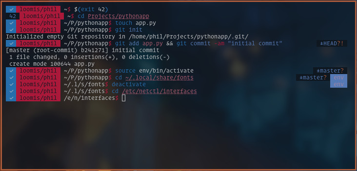

# ABBR ZSH theme

### Screenshots

### Segments
* Exit code (tick on 0, else exit code) with colorization
* hostname/username
* Abbreviated PWD
* $ or # (privilege)

### Badges
* Python virtualenv
* Rust version (detects Cargo.toml)
* Git status (branch name, untracked, dirty)

### Variables
|Variable                        |Default   |
|--------------------------------|----------|
|ABBR_BADGE_GIT_SYMBOL           |`\u00b1`  |
|ABBR_BADGE_GIT_UNTRACKED_SYMBOL |?         |
|ABBR_BADGE_GIT_DIRTY_SYMBOL     |!         |

### Colors
You can change the prompt colors by changing these variables in your `.zshrc`.

|Variable                    |Default          |
|----------------------------|-----------------|
|ABBR_FG_RETVAL_GOOD         |white            |
|ABBR_BG_RETVAL_GOOD         |green            |
|ABBR_FG_RETVAL_BAD          |yellow           |
|ABBR_BG_RETVAL_BAD          |black            |
|ABBR_FG_LOGON               |black            |
|ABBR_BG_LOGON               |cyan             |
|ABBR_FG_PWD                 |white            |
|ABBR_BG_PWD                 |none             |
|ABBR_FG_PROMPT_ROOT         |red              |
|ABBR_BG_PROMPT_ROOT         |none             |
|ABBR_FG_PROMPT_DEFAULT      |`$ABBR_BG_LOGON` |
|ABBR_BG_PROMPT_DEFAULT      |none             |
|ABBR_FG_BADGE_PYTHON_VENV   |blue             |
|ABBR_BG_BADGE_PYTHON_VENV   |yellow           |
|ABBR_FG_BADGE_RUST          |white            |
|ABBR_BG_BADGE_RUST          |blue             |
|ABBR_FG_BADGE_GIT           |yellow           |
|ABBR_BG_BADGE_GIT           |black            |
|ABBR_FG_BADGE_GIT_UNTRACKED |red              |
|ABBR_FG_BADGE_GIT_DIRTY     |red              |

### How does the path abbreviation work?
Basically, similar to the one you find in `vim`.
Every path inside the home directory will start with `~` rather than the absolute path.
Each directory in the current PWD will be shortened to one character,
execept it starts with a `.`, then, two characters will be displayed.
The current folder will not be abbreviated.

Examples (username is phil):
* `/home/phil` -> `~`
* `/home/phil/test/abc` -> `~/t/abc`
* `/home/phil/.local/share/nano` -> `~/.l/s/nano`
* `/home/phil_butnotphil/test` -> `/h/p/test`
* `/home/linus` -> `/h/linus`

